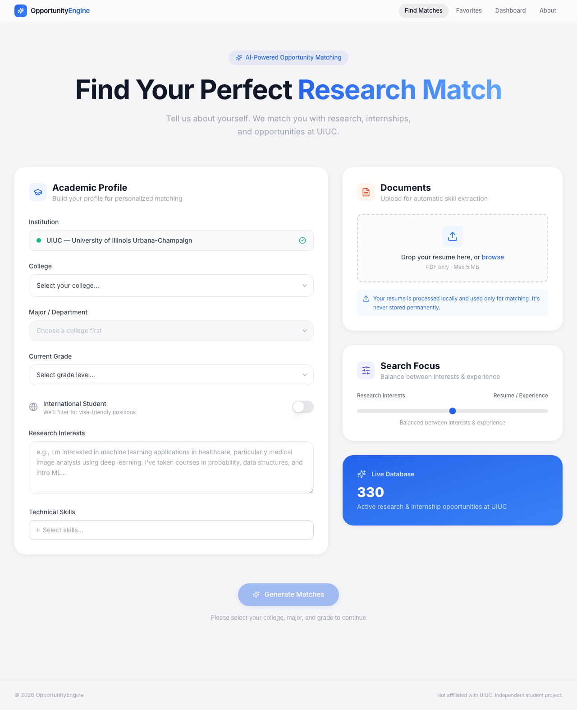
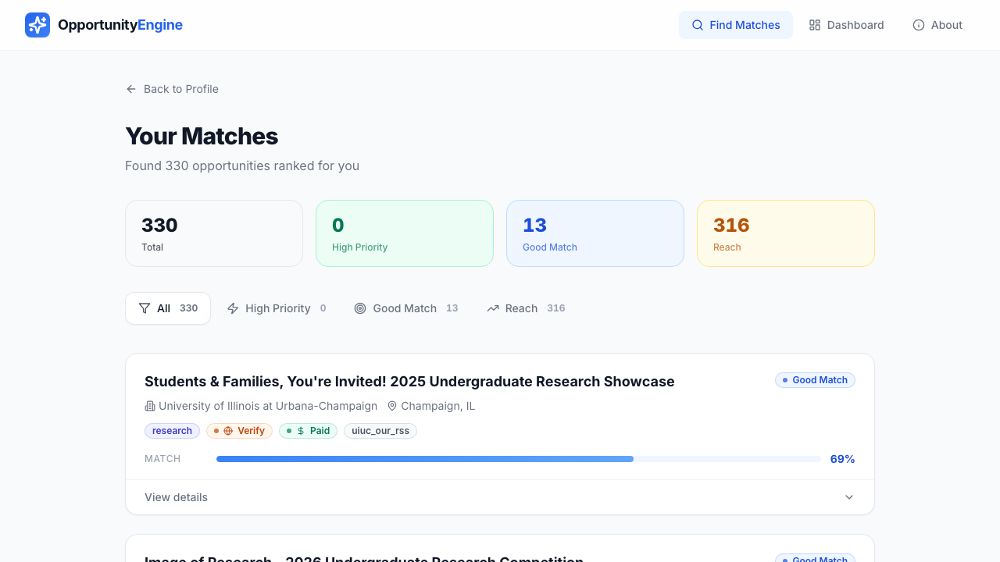
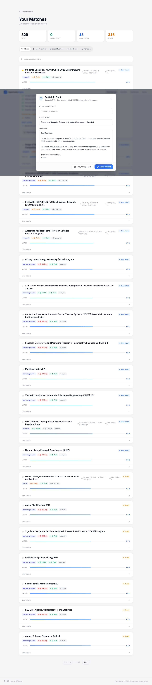
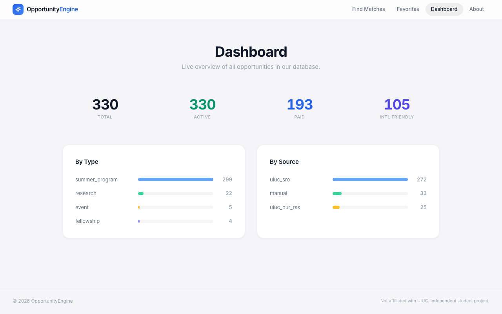

# OpportunityEngine

A personalized research and internship matching engine for UIUC undergraduates. Automatically collects 330+ opportunities from multiple sources, then ranks and explains each match based on your profile.

Not a job board. A decision engine that answers three questions:
1. **Can I apply?** (Eligibility)
2. **Should I apply?** (Readiness)
3. **What should I do next?** (Actionable Guidance)

**[Live Demo](https://frontend-wine-pi-63.vercel.app)** | **[API](https://opportunity-filter-engine.vercel.app/api/health)**

## Screenshots

### Profile Builder
Two-column form with college/major cascading dropdowns, international student filtering, resume upload with auto-skill extraction, and a research interest/experience balance slider.



### Ranked Results
Every opportunity is scored (Eligibility 0.45 + Readiness 0.35 + Upside 0.20) and bucketed into High Priority, Good Match, or Reach. Each card explains *why it fits* and *what gaps you have*.



### Cold Email Generator
One-click draft with pre-filled subject line and body, personalized to your profile and the specific opportunity. Copy to clipboard or open directly in your email client.



### Opportunity Dashboard
Live stats across all scraped sources: total opportunities, paid positions, international-friendly count, breakdowns by type and source.



## Why This Exists

UIUC scatters opportunities across 7+ platforms with no unified view:

| Source | What it has | Problem |
|--------|------------|---------|
| OUR Blog | Faculty-posted research positions | RSS feed exists but nobody parses it |
| SRO Database | 279+ external summer programs | 12 pages of unfiltered Drupal listings |
| Handshake | Jobs + some research | Login-gated, mixes everything together |
| CS Opportunities | CS/ECE research | NetID required, ~70 listings/year |
| Research Park | 800+ intern positions/year | Separate site, not linked to research |
| Department pages | Lab-specific openings | Scattered across 50+ faculty sites |
| External REUs | 500+ NSF-funded programs | Requires knowing where to look |

International freshmen have it worst: they can't tell what's realistic, what requires citizenship, or where to even start.

## Tech Stack

| Layer | Technology |
|-------|-----------|
| Frontend | Next.js 14, React 18, TypeScript, Tailwind CSS |
| Backend | FastAPI, Python 3.11, Pydantic v2 |
| Data Collection | BeautifulSoup, feedparser, requests |
| Matching | Rule-based three-layer scoring engine |
| Testing | pytest (33 integration tests) |

## Architecture

```
Data Sources (OUR RSS, SRO Scraper, Manual Entries)
        │
        ▼
Normalization Pipeline (raw text → structured fields → LLM tagging)
        │
        ▼
Opportunity Database (330+ normalized records, JSON)
        │
        ▼
Matching Engine (eligibility × readiness × upside scoring)
        │
        ▼
Web Interface (Next.js + FastAPI)
  ├── Profile form with resume parsing
  ├── Ranked results with explanations
  ├── Cold email generator with mailto: links
  └── Dashboard with live stats
```

## Run Locally

### Prerequisites
- Python 3.11+
- Node.js 18+

### Backend
```bash
pip install -r requirements.txt
uvicorn backend.main:app --host 127.0.0.1 --port 8000
```

### Frontend
```bash
cd frontend
npm install
npm run dev
```

Open http://localhost:3000. The frontend proxies API requests to the backend automatically.

### Tests
```bash
pytest tests/ -v
```

## Project Structure

```
opportunity-filter-engine/
├── backend/                  # FastAPI REST API
│   ├── main.py               # App entry, CORS, routing
│   ├── schemas.py            # Pydantic request/response models
│   └── routes/
│       ├── matches.py        # POST /api/matches
│       ├── opportunities.py  # GET /api/opportunities
│       ├── cold_email.py     # POST /api/cold-email
│       └── resume.py         # POST /api/resume/upload
├── frontend/                 # Next.js 14 app
│   └── src/
│       ├── app/              # Pages (home, results, dashboard, about)
│       ├── components/       # MatchCard, ColdEmailModal, ResumeUpload, etc.
│       └── lib/              # API client, types, college data
├── src/                      # Core Python engine
│   ├── collectors/           # Source-specific scrapers
│   ├── parsers/              # LLM tagger + rule-based fallback
│   ├── normalizers/          # Raw → standardized schema
│   ├── matcher/              # Three-layer scoring engine
│   └── recommender/          # Cold email + resume gap advisor
├── data/
│   ├── processed/            # 330+ normalized opportunities
│   └── manual_entries/       # Hand-curated entries
└── tests/                    # 33 integration tests
```

## Author

Guoyi Xu (Eric) - UIUC Electrical & Computer Engineering

## License

MIT
