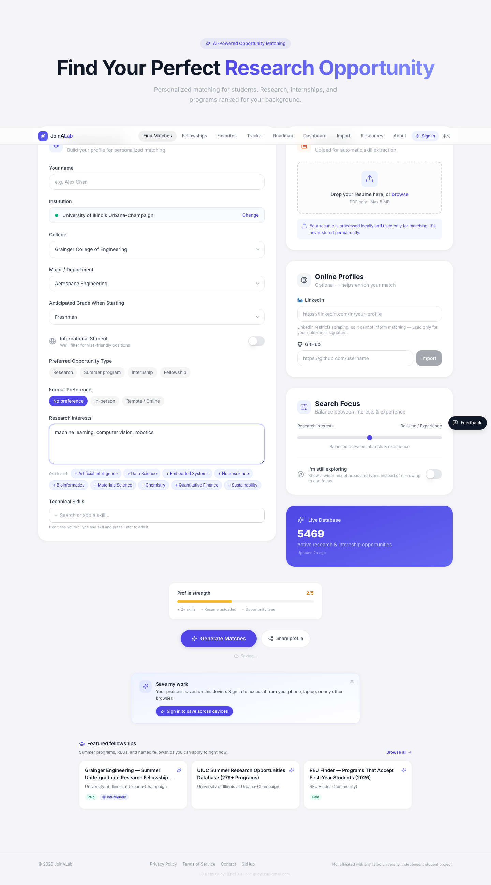
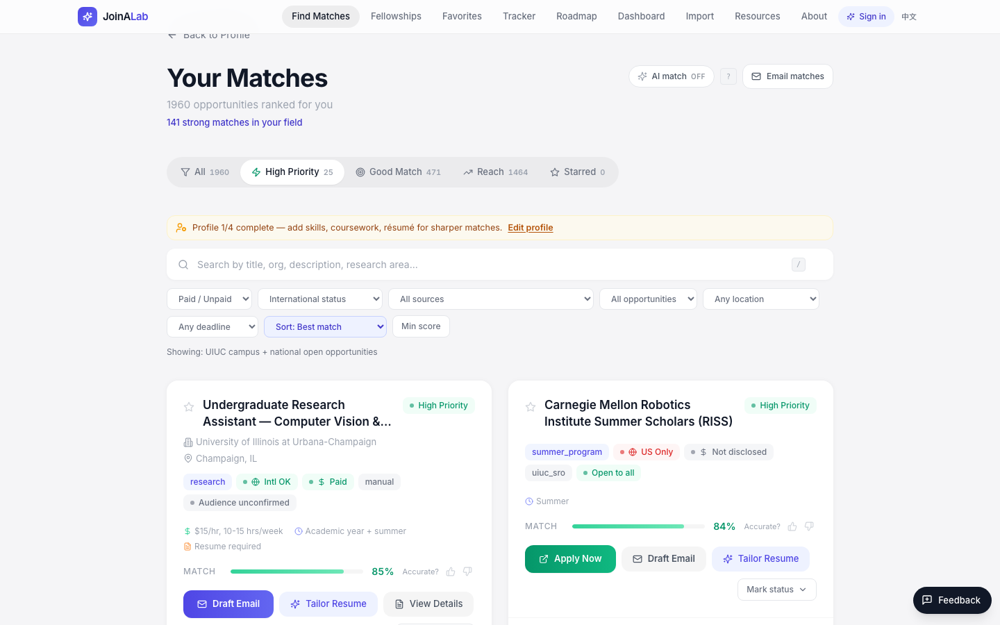
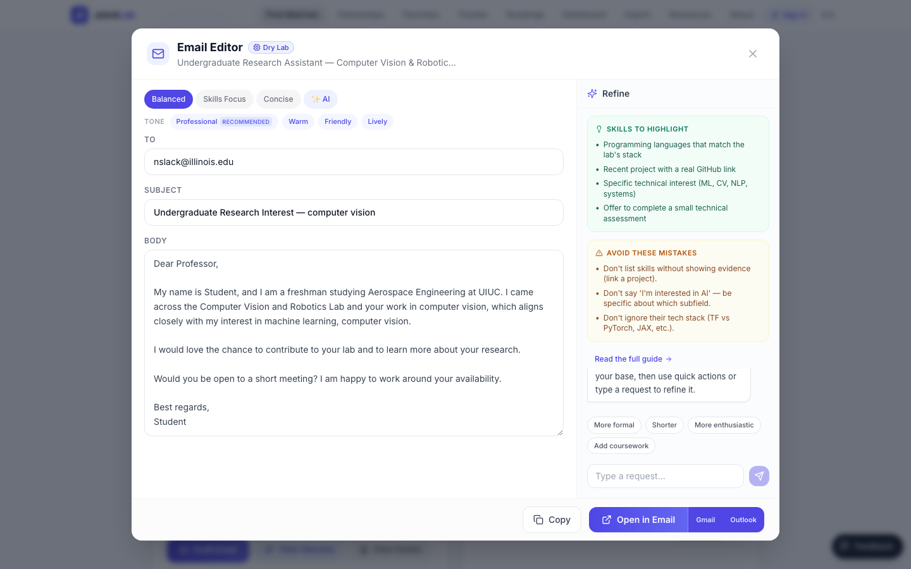
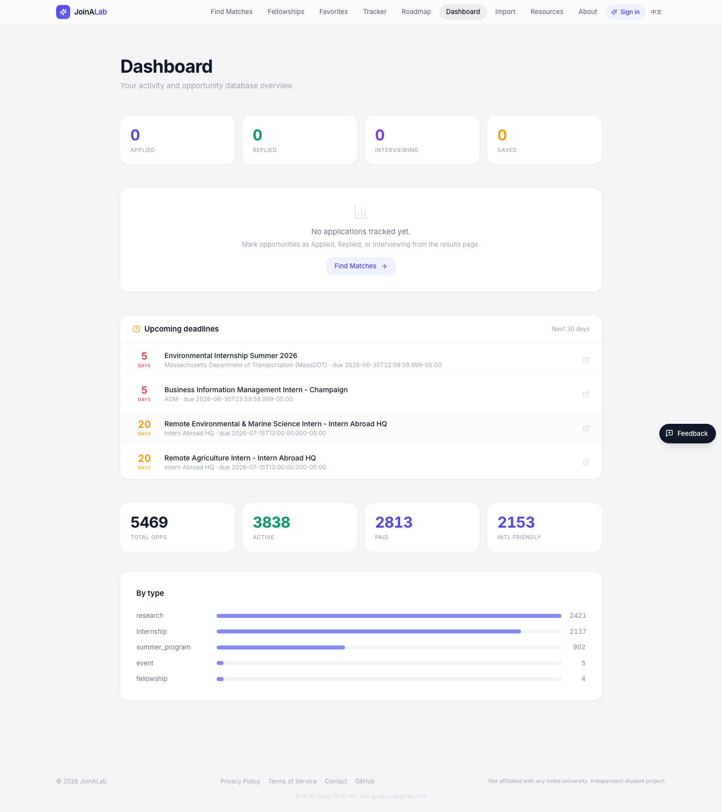

# JoinALab

A personalized research, internship, and fellowship matching engine for university students. JoinALab collects thousands of opportunities — campus research databases, faculty directories, NSF REU programs, internship boards, and more — then ranks and explains each match against your profile.

Not a job board. A decision engine that answers three questions:
1. **Can I apply?** (Eligibility)
2. **Should I apply?** (Readiness)
3. **What should I do next?** (Actionable guidance)

Matching is **field-aware**: your stated research interests lead the ranking, while your major and college steer it — so a veterinary student and a CS student searching the same words see different, field-appropriate labs.

Built for the students each campus serves worst — including international students, who often can't tell what's realistic, what requires citizenship, or where to even start. It launched at the University of Illinois Urbana-Champaign and is rolling out to more campuses (UC Berkeley is live; others are queued).

**[Live](https://joinalab.com)** | **[API](https://opportunity-filter-engine-api.onrender.com/api/health)**

## Screenshots

### Profile Builder
Two-column form with college/major cascading dropdowns, a multi-domain skill picker (add your own), clickable research-interest suggestions, international-student filtering, resume upload with auto-skill extraction, and a research interest/experience balance slider.



### Ranked Results
Every opportunity is scored (Eligibility 0.45 + Readiness 0.35 + Upside 0.20) and bucketed into High Priority, Good Match, or Reach. Your major and college steer the ranking while your stated interests lead it, and the header surfaces how many opportunities truly match your field. Each card explains *why it fits* and *what gaps you have*.



### Cold Email Generator
One-click draft with a pre-filled subject line and body, personalized to your profile and the specific opportunity. Copy to clipboard or open directly in your email client.



### Opportunity Dashboard
Live stats across all scraped sources: total opportunities, paid positions, international-friendly count, breakdowns by type and source.



## Why This Exists

Every campus scatters opportunities across a dozen disconnected platforms with no unified, eligibility-aware view. The launch campus (UIUC) is a representative example of the fragmentation JoinALab unifies:

| Source | What it has | Problem | Our solution |
|--------|------------|---------|------|
| Research blogs / RSS | Faculty-posted research positions | Feeds exist but nobody parses them | ✅ Auto-parsed |
| Summer research databases | Hundreds of external programs | Pages of unfiltered listings | ✅ Scraped + normalized |
| Handshake | Jobs + some research | Login-gated, mixes everything together | ✅ Cookie-auth collector |
| Department / faculty pages | Lab-specific openings | Scattered across 50+ sites per school | ✅ Faculty directories, multi-school |
| External REUs | 500+ NSF-funded programs | Requires knowing where to look | ✅ Pulled from the NSF Awards API |
| Research parks / internships | Hundreds of positions per year | Separate sites, not linked to research | ✅ Scraped |

International students have it worst: they can't tell what's realistic, what requires citizenship, or where to even start. JoinALab makes eligibility a first-class signal, not an afterthought.

## Tech Stack

| Layer | Technology |
|-------|-----------|
| Frontend | Next.js 16, React 19, TypeScript, Tailwind CSS |
| Backend | FastAPI, Python 3.11, Pydantic v2 |
| Database | Supabase (profiles, favorites, interactions, saved searches, attachments, version history) |
| Data Collection | BeautifulSoup, feedparser, requests, NSF Awards API |
| Matching | Field-aware three-layer scoring (eligibility × readiness × upside) — interests lead, major/college steer — + TF-IDF semantic similarity |
| LLM | OpenRouter for cold-email refinement and the Ask-AI assistant |
| Deploy | Vercel (frontend) + Render (backend), GitHub Actions (twice-weekly data refresh, daily saved-search refresh) |

## Architecture

```
Data Sources (multi-school collectors: faculty directories, research DBs,
              NSF REU, Handshake, Simplify, RSS feeds, research parks, manual, …)
        │
        ▼
Normalization Pipeline (raw text → structured fields → skill/keyword inference)
        │
        ▼
Opportunity Database (5,400+ normalized records, auto-refreshed twice weekly)
        │
        ▼
Matching Engine (field-aware: eligibility × readiness × upside + TF-IDF semantic
                similarity; stated interests lead, major + college steer)
        │
        ▼
Web Interface (Next.js + FastAPI + Supabase)
  ├── Profile form with resume parsing, GitHub import, auto-save
  ├── Ranked results with lab-specific explanations + filters
  ├── Cold email generator (multiple tones + LLM refinement)
  ├── Compare (6-axis radar), favorites + saved searches (cross-device sync)
  ├── Application tracker, dashboard, and a skill-gap roadmap
  └── Manual import (paste a URL or a full posting → AI extraction)
```

Adding a school is a config + collector exercise: a school registry (`src/collectors/school_config.py`) plus a shared faculty-collector base let new campuses reuse the same normalization and matching pipeline.

## Run Locally

### Prerequisites
- Python 3.11+
- Node.js 18+

### Backend
```bash
pip install -r requirements.txt
uvicorn backend.main:app --host 127.0.0.1 --port 8000
```

### Frontend
```bash
cd frontend
npm install
npm run dev
```

Open http://localhost:3000. The frontend proxies API requests to the backend automatically.

### Tests

```bash
# Backend: pytest — unit + integration + API tests
pytest tests/ -v

# Frontend unit tests: vitest — 1,000+ tests over lib/ modules, components + helpers
cd frontend
npm test

# Frontend E2E: playwright — real-browser specs, runs both servers
# (some auto-skip in environments without NEXT_PUBLIC_SUPABASE_*)
cd frontend
npx playwright install chromium       # one-time browser download
npm run test:e2e                      # headless
npm run test:e2e:ui                   # watch/debug UI
```

The backend and frontend-unit suites run automatically in CI on every push/PR
(see `.github/workflows/ci.yml`).

## Project Structure

```
opportunity-filter-engine/
├── backend/                  # FastAPI REST API
│   ├── main.py               # App entry, CORS, routing
│   ├── schemas.py            # Pydantic request/response models
│   └── routes/
│       ├── matches.py        # POST /api/matches
│       ├── opportunities.py  # GET /api/opportunities
│       ├── cold_email.py     # POST /api/cold-email
│       ├── resume.py         # POST /api/resume/upload
│       └── saved_searches.py # POST /cron/saved-searches/refresh
├── frontend/                 # Next.js 16 app
│   ├── src/
│   │   ├── app/              # Pages (home, results, favorites, compare, tracker, dashboard, roadmap, …)
│   │   ├── components/       # MatchCard, ColdEmailModal, OnboardingIntro, etc.
│   │   └── lib/              # API client, supabase wrapper, schools registry, types
│   └── e2e/                  # Playwright specs
├── src/                      # Core Python engine
│   ├── collectors/           # Source- and school-specific scrapers
│   │   ├── school_config.py  # School registry (org, location, id prefixes)
│   │   ├── faculty_base.py   # Shared faculty-collector base
│   │   ├── uiuc_*.py         # UIUC: SRO, faculty dirs, OUR RSS, Research Park, …
│   │   ├── ucb_*.py          # UC Berkeley faculty directories (EECS, Chem, BioE, …)
│   │   ├── nsf_reu.py        # NSF REU Awards API
│   │   └── handshake.py      # Handshake with cookie auth
│   ├── matcher/              # Three-layer scoring + TF-IDF
│   │   ├── ranker.py         # Eligibility × readiness × upside
│   │   └── embeddings.py     # Semantic similarity (TF-IDF / embeddings)
│   └── recommender/          # Cold email + resume gap advisor
├── supabase/
│   └── migrations/           # SQL migrations (RLS, anon auth, saved searches, analytics, feedback, …)
├── data/
│   ├── processed/            # 5,400+ normalized opportunities
│   └── manual_entries/       # Hand-curated entries
├── .github/workflows/        # CI + twice-weekly refresh + daily saved-search cron
└── tests/                    # Integration tests
```

## Author

Guoyi (Eric) Xu — UIUC Electrical & Computer Engineering
[eric.guoyi.xu@gmail.com](mailto:eric.guoyi.xu@gmail.com) · [GitHub](https://github.com/EricXu-0805)

## License

MIT
