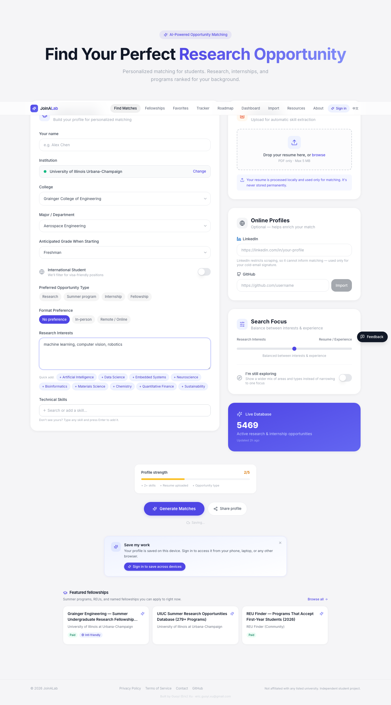
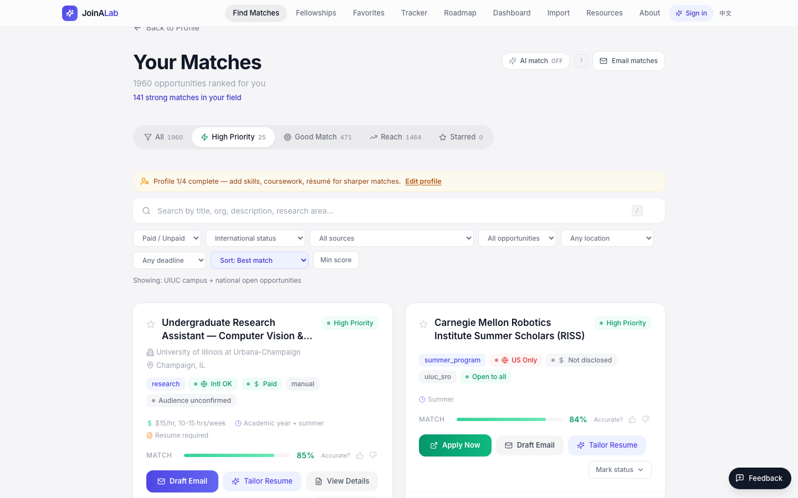
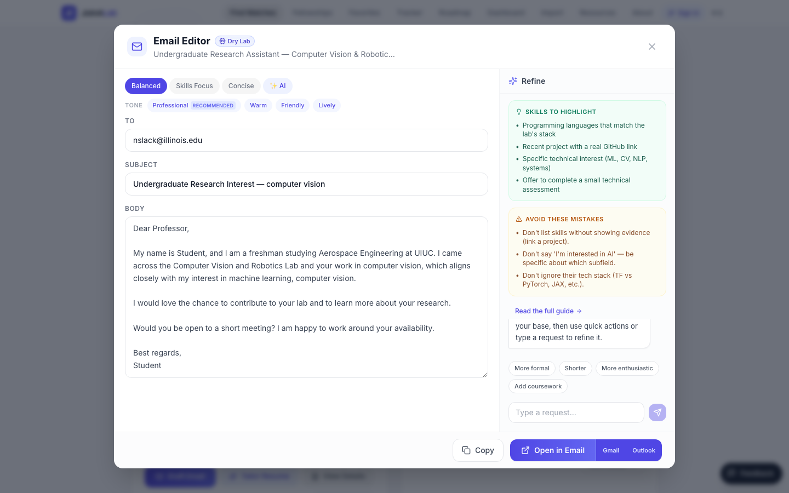
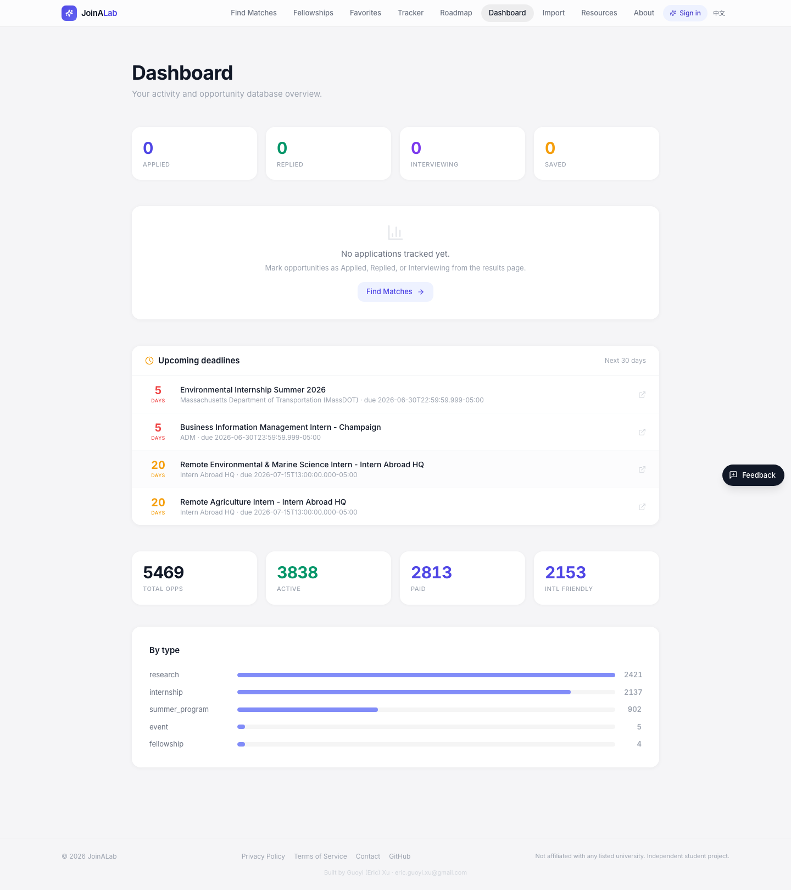

# JoinALab

A personalized research and internship matching engine for university students. JoinALab collects opportunities — faculty directories and campus research programs at 115 universities, NSF REU sites, internship lists, and more (142,861 records in the 2026-10-08 refresh) — then ranks and explains each match against your profile.

Not a job board. A decision engine that answers three questions:
1. **Can I apply?** (Eligibility)
2. **Should I apply?** (Readiness)
3. **What should I do next?** (Actionable guidance)

Matching is **field-aware**: your stated research interests lead the ranking, while your major and college steer it — so a veterinary student and a CS student searching the same words see different, field-appropriate labs.

Built for the students each campus serves worst — including international students, who often can't tell what's realistic, what requires citizenship, or where to even start. It launched at the University of Illinois Urbana-Champaign and now covers 115 universities; `src/school_scope.py` records the schools it has dropped and why.

**[Live](https://joinalab.com)** | **[API](https://opportunity-filter-engine-api.onrender.com/api/health)**

## Scope, to-do list and docs

- **What ships.** Several built features (compare, fellowships, the roadmap, Ask AI, payments) are switched off in the public release. `docs/product_scope.md` lists every release flag, its state, and why each closed one is closed.
- **The to-do list.** Open work lives in one place: the owner's MVP checklist (the private "OE todolist" Google Doc, MVP tab, items M01–M70). Ask the owner for access. `docs/roadmap.md`, `docs/PROJECT_PLAN.md`, `docs/MASTER_PLAN.md` and `docs/future_features.md` are earlier plans, kept for history.
- **Operations.** `RUNBOOK.md` covers the scheduled jobs, the weekly refresh rotation, migrations (including how to name a new one) and environment setup. `docs/RELEASE.md` covers releases and rollback. `docs/collector_sop.md` is the procedure for adding a school.

## Screenshots

Captured 2026-06-26. The navigation in them still shows Fellowships and Roadmap, which the current release hides.

### Profile Builder
Two-column form with college/major cascading dropdowns, a multi-domain skill picker (add your own), clickable research-interest suggestions, international-student filtering, resume upload with auto-skill extraction, and a research interest/experience balance slider.



### Ranked Results
Every opportunity is scored (Eligibility 0.45 + Readiness 0.35 + Upside 0.20) and bucketed into High Priority, Good Match, or Reach. Your major and college steer the ranking while your stated interests lead it, and the header surfaces how many opportunities truly match your field. Each card explains *why it fits* and *what gaps you have*.



### Cold Email Generator
One-click draft with a pre-filled subject line and body, personalized to your profile and the specific opportunity. Copy to clipboard or open directly in your email client.



### Dashboard
Your saved count, upcoming deadlines, pending reminders and application tracker on one page, plus how long ago the opportunity data was refreshed. (The screenshot predates this layout: it still shows corpus-wide counts.)



## Why This Exists

Every campus scatters opportunities across a dozen disconnected platforms with no unified, eligibility-aware view. The launch campus (UIUC) is a representative example of the fragmentation JoinALab unifies:

| Source | What it has | Problem | Our solution |
|--------|------------|---------|------|
| Research blogs / RSS | Faculty-posted research positions | Feeds exist but nobody parses them | ✅ Auto-parsed |
| Summer research databases | Hundreds of external programs | Pages of unfiltered listings | ✅ Scraped + normalized |
| Handshake | Jobs + some research | Login-gated, mixes everything together | Cookie-auth collector exists; not in the scheduled refresh |
| Department / faculty pages | Lab-specific openings | Scattered across 50+ sites per school | ✅ Faculty directories, multi-school |
| External REUs | 500+ NSF-funded programs | Requires knowing where to look | ✅ Pulled from the NSF Awards API |
| Research parks / internships | Hundreds of positions per year | Separate sites, not linked to research | ✅ Scraped |

International students have it worst: they can't tell what's realistic, what requires citizenship, or where to even start. JoinALab makes eligibility a first-class signal, not an afterthought.

## Tech Stack

| Layer | Technology |
|-------|-----------|
| Frontend | Next.js 16, React 19, TypeScript, Tailwind CSS |
| Backend | FastAPI, Python 3.11, Pydantic v2 |
| Database | Supabase (profiles, favorites, interactions, saved searches, attachments, version history) |
| Data Collection | BeautifulSoup, feedparser, requests, NSF Awards API |
| Matching | Field-aware three-layer scoring (eligibility × readiness × upside) — interests lead, major/college steer — + TF-IDF semantic similarity |
| LLM | OpenAI, Gemini or OpenRouter (`backend/lib/llm.py`) for cold-email drafting and résumé tailoring |
| Deploy | Vercel (frontend) + Render (backend), GitHub Actions (daily data refresh that re-scrapes each school once a week, reminders, saved-search digests, ops scan) |

## Architecture

```
Data Sources (multi-school collectors: faculty directories, research DBs,
              NSF REU, Handshake, Simplify, RSS feeds, research parks, manual, …)
        │
        ▼
Normalization Pipeline (raw text → structured fields → skill/keyword inference)
        │
        ▼
Opportunity corpus (one JSON shard per school; every school re-scraped weekly)
        │
        ▼
Matching Engine (field-aware: eligibility × readiness × upside + TF-IDF semantic
                similarity; stated interests lead, major + college steer)
        │
        ▼
Web Interface (Next.js + FastAPI + Supabase)
  ├── Profile form with resume parsing, GitHub import, auto-save
  ├── Ranked results with lab-specific explanations + filters
  ├── Cold email generator (multiple tones + LLM refinement)
  ├── Résumé tailoring for one target
  ├── Favorites + saved searches with email digests (cross-device sync)
  ├── Application tracker and dashboard, with Web Push / email reminders
  └── Private import (paste a URL or a full posting → AI extraction)
```

Adding a school is mostly configuration: config modules in `src/collectors/schools/` for the shared engines (`src/collectors/faculty_graph.py`, `src/collectors/campus_graph.py`), a `SOURCE_DEFAULTS` entry in `src/normalizers/school_audience.py`, and a slot in the weekly rotation (`scripts/refresh_rotation.py`). `docs/collector_sop.md` is the full procedure.

## Run Locally

### Prerequisites
- Python 3.11 (CI's version)
- Node.js 24 (CI's version; Next.js 16 needs 20.9 or newer)

### Backend
```bash
python3.11 -m venv .venv && source .venv/bin/activate
pip install -r requirements.txt
uvicorn backend.main:app --host 127.0.0.1 --port 8000
```

The backend reads the committed corpus shards in `data/processed/shards/` directly. Startup parses all of them before `/api/health` answers: on 2026-10-09 that took 22 seconds and left the process at 1.4 GB RSS on an Apple-silicon Mac.

### Frontend
```bash
cd frontend
npm ci
npm run dev
```

Open http://localhost:3000. `/api/*` is proxied to `BACKEND_URL`, which defaults to `http://127.0.0.1:8000` outside production.

### Tests

These match the jobs in `.github/workflows/ci.yml`. Run them from the repository root; the block changes directory where it says `cd`.

```bash
# Backend lint (CI pins ruff 0.7.4)
uvx ruff@0.7.4 check backend src tests

# Backend tests. Assemble the corpus work file first: the data-quality tests
# read data/processed/opportunities.json, which is gitignored. assemble skips
# when that file exists; add --force after pulling new shards.
python scripts/shard_corpus.py assemble
pytest tests/

# Frontend typecheck, lint, unit tests (vitest) and production build
cd frontend
npx tsc --noEmit
npm run lint
npm test
npm run build

# Frontend E2E (Playwright). The config starts a Supabase stub, the backend
# (`python3 -m uvicorn`, so keep the backend virtualenv active), a fixture
# proxy and `next dev` itself.
npx playwright install chromium       # one-time browser download
npm run test:e2e -- --project=chromium
npm run test:e2e:ui                   # watch/debug UI

# Migrations: replay the whole chain into a throwaway local Postgres
# (needs initdb/pg_ctl/psql on PATH; the second also needs Supabase CLI 2.95.4)
cd ..
bash supabase/tests/run_flow_b_test.sh
bash supabase/tests/run_supabase_cli_migration_test.sh
```

Notes:
- `tests/conftest.py` forces every release flag on, except in the five modules that set `RELEASE_CONTRACT_TESTS = True`. `tests/test_release_scope.py` is the one that tests the shipped flag table.
- To run E2E beside another checkout, move its servers with `E2E_PORT`, `E2E_BACKEND_PORT`, `E2E_RESEARCH_PROXY_PORT` and `E2E_SUPABASE_PORT` (defaults 3100, 8100, 8101, 54321). The CLI migration replay takes `OFE_SUPABASE_CLI_TEST_PORT` (default 55436).
- `tests/test_docs_current.py` fails when this README, `RUNBOOK.md` or `docs/product_scope.md` names a file that does not exist, or when the scope doc's flag table disagrees with the code.

## Project Structure

```
opportunity-filter-engine/
├── backend/                  # FastAPI REST API
│   ├── main.py               # App entry, CORS, routing, release-scope middleware
│   ├── schemas.py            # Pydantic request/response models
│   ├── lib/release_scope.py  # Server-side release flags
│   └── routes/
│       ├── matches.py        # POST /api/matches
│       ├── opportunities.py  # GET /api/opportunities
│       ├── cold_email.py     # POST /api/cold-email
│       ├── tailor.py         # Résumé tailoring
│       ├── push.py           # GET /api/cron/reminders, Web Push
│       └── saved_searches.py # GET /api/cron/saved-searches/refresh and /digest
├── frontend/                 # Next.js 16 app
│   ├── src/
│   │   ├── app/              # Pages (home, results, opportunities/[id], favorites, tracker, dashboard, import, …)
│   │   ├── components/       # MatchCard, ColdEmailModal, OnboardingIntro, etc.
│   │   └── lib/              # API client, supabase wrapper, schools registry, release-scope.ts, types
│   └── e2e/                  # Playwright specs
├── src/                      # Core Python engine
│   ├── collectors/           # Source- and school-specific scrapers
│   │   ├── refresh_all.py    # Refresh entry point (shards, deep mode, time budget)
│   │   ├── faculty_graph.py  # Shared faculty-directory engine
│   │   ├── campus_graph.py   # Shared campus-programs engine
│   │   ├── schools/          # One config module per school for the two engines
│   │   ├── uiuc_*.py         # UIUC: SRO, faculty dirs, OUR RSS, Research Park, …
│   │   ├── ucb_*.py          # UC Berkeley faculty directories (EECS, Chem, BioE, …)
│   │   ├── nsf_reu.py        # NSF REU Awards API
│   │   └── handshake.py      # Handshake with cookie auth (not in the scheduled refresh)
│   ├── school_scope.py       # Schools the product has dropped, with the reason
│   ├── matcher/              # Three-layer scoring + TF-IDF
│   │   ├── ranker.py         # Eligibility × readiness × upside
│   │   └── embeddings.py     # Semantic similarity (TF-IDF / embeddings)
│   └── recommender/          # Cold email + resume gap advisor
├── scripts/                  # refresh_rotation.py, shard_corpus.py, release_gate.py, …
├── supabase/
│   ├── migrations/           # SQL migrations (naming rules: RUNBOOK.md section 4)
│   └── tests/                # Real-Postgres migration and RLS tests
├── data/
│   ├── processed/shards/     # The corpus: one minified JSON file per school, plus national.json
│   ├── snapshots/            # Hand exports of login-only sources
│   └── manual_entries/       # Hand-curated entries
├── .github/workflows/        # CI, daily refresh rotation, reminders, saved searches, ops scan, release gate
└── tests/                    # pytest suite
```

## Author

Guoyi (Eric) Xu — UIUC Electrical & Computer Engineering
[eric.guoyi.xu@gmail.com](mailto:eric.guoyi.xu@gmail.com) · [GitHub](https://github.com/EricXu-0805)

## License

MIT
